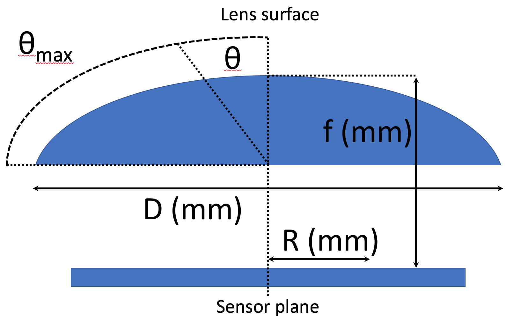
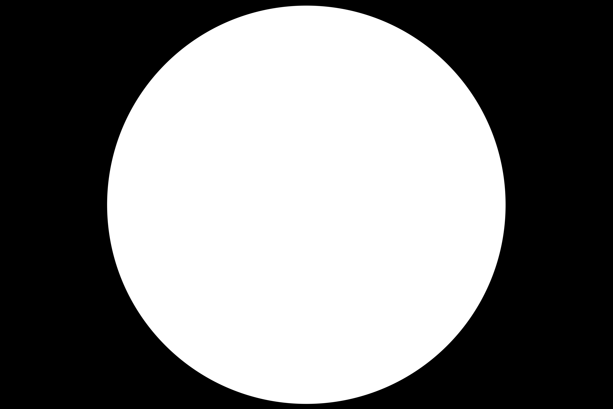

# Using hemispherical photography for estimation of forest/woodland canopy traits


# Taking hemispherical photos

A list of checks for taking good hemispherical photos:

* Take photos under a uniformly overcast sky, ideally before the sun has risen too high in the sky, or just before sunset, this avoids lens flare and helps to increase the contrast between plant material and sky. I find in the morning the photos are generally better due to the quality of the light. At high latitudes you will have more time than in the tropics.
* Ensure that the camera is level on the tripod and the lens is pointing straight up. Use a spirit level attached to the camera hotshoe to do this.
* Adjust the tripod so that the top of the camera lens is 1 m above the ground, or above any understorey vegetation, whichever is higher. I usually find that adjusting the legs of the tripod is easiest, but every tripod is different.
* Turn the camera so the top of the camera body is facing north, bring a compass! This ensures that the top of the captured photo is also facing north, which is necessary for calculating LAI.
* Make use of the visual display on the camera, if there is one, to get a good view of the photo before you take it.
* Set the camera:
	* Manual shooting mode
	* Manual focus
	* Set the focus to infinity.
	* Set the exposure compensation to -0.7. This makes thresholding the image easier later on.
	* Capture fine jpeg & RAW images at the same time
	* Ensure the camera time and date is accurate (this is purely for ease of matching photos to sites).
	* Set the Aperture to about 7. This is only a guideline.
	* Adjust the ISO and shutter speed so the photo is neutrally exposed but the shutter speed is always over 1/60sec, otherwise you will introduce camera shake when you press the button.
	* Take all photos in landscape dimensions, never portait.
* Make sure everybody ducks down below the camera when the image is being taken!
* Make sure there is a battery and you have a spare battery.
* Make sure there is an SD card in the camera, and take a spare.
* Cover the lens with the lens cap between photos to prevent accidents.

A daily kit list for taking hemispherical photos:

* Camera with appropriate fisheye lens
* Lens cap for camera
* Lens cleaning solution and lens cloth
* Tripod
* Fully charged battery for camera
* 2 SD cards
* Spirit level hotshoe attachment for camera
* Compass
* Notebook and pencil
* GPS unit
* tape measure > 2 m
* Waterproof bag to cover camera


An ideal list of products for a high quality DSLR camera setup:

* Nikon D750 DSLR Camera Body
* Sigma 8 mm f3.5 Circular Fisheye EX DG For Nikon Lens
* Hotshoe Fit Spirit Level
* Integral USB SD Card Reader
* 2x Sandisk Ultra 30 MB/s SDHC Card 16 GB Class 10
* Hard peli-case to fit equipment in, e.g. Peli-1520 with foam
* A sturdy tripod


# Creating black and white thresholded images manually

1. Open ImageJClick `Apply` to binarize the images
2. `File -> Open`, then select an image
3. Visually inspect the image to see that there isn't massive amounts of lens flare. If you have lots of lens flare, the photo should be thrown out. This is what lens flare looks like:


4. `Image -> Type -> 8-bit`
5. `Image -> Adjust -> Threshold`, tick `Dark background` and manually adjust the image so all sky is entirely red and the branches are grey, or as near as you can get it. Click `Apply` to binarize the image.
6. Save the newly thresholded image as a `.tif` in a folder called `img`. The image should have black branches and white sky.
7. Rinse and repeat for all images.

The above process can be automated with a macro, but this assumes that the images are all uniformly exposed.

This is the macro, which should be saved as a `.ijm` file and called via `ImageJ -> Plugins -> Macros -> Run..`. The macro can also be found in `hemi_photo_guide/macros/binarize.ijm`.

```
// Binarize all images with a given algorithm and save

// User inputs
///////////////////////////////////

input_path = "/Users/johngodlee/Desktop/input/";

output_path = "/Users/johngodlee/Desktop/output/"

algorithm = "Default"

///////////////////////////////////
// END user inputs

list = getFileList(input_path);

for (i=0; i<(list.length); i++) {

	open(""+input_path+list[i]+"");

	file_name = getInfo("image.filename");

	run("8-bit");

	setAutoThreshold(algorithm);
	setOption("BlackBackground", false);
	run("Convert to Mask");

	saveAs("tif", ""+output_path+file_name+"");

	image_id = getImageID();
	selectImage(image_id);
	close();
}
```

I find that the [`Huang`](http://www.ktl.elf.stuba.sk/study/vacso/Zadania-Cvicenia/Cvicenie_3/TimA2/Huang_E016529624.pdf) algorithm normally works well, but you should experiment with different algorithms to find the one which works best under different conditions. `Default` is also widely appropriate for hemispherical photos.

An alternative to simple thresholding of 8-bit greyscale images is to use a colour thresholding technique. Plant material often has very little blue in it, while the sky generally has more, so you can threshold using only the blue channel of the image with this macro, also found in `hemi_photo_guide/macros/binarize_blue_channel.ijm`:

```
// User inputs
///////////////////////////////////

input_path = "/Users/johngodlee/Desktop/input/";

output_path = "/Users/johngodlee/Desktop/output/";

algorithm = "Default"

///////////////////////////////////
// END user inputs


list = getFileList(input_path);


for (i=0; i<(list.length); i++){

	open(""+input_path+list[i]+"");

	file_name = getInfo("image.filename");

	run("Split Channels");

	selectWindow(file_name+" (blue)");

	setAutoThreshold(algorithm);

	run("Convert to Mask");

	saveAs("tif", ""+output_path+"blue_"+file_name+"");

	close("*");
}
```

# Calculating gap fraction with ImageJ

Gap fraction is the percentage of the image covered by sky.

This process is fairly simple. Basically, from the binarized `.tif` images you made earlier, you just count the number of pixels which are sky in the image, i.e. white in the thresholded image, then divide by the total number of pixels in the image. It's slightly more complicated when the image is a circle within a larger frame, but not much.

To do this manually:

1. Open ImageJ
2. `File -> Open`, then select a binarized `.tif` image 
3. `Edit -> Invert` to invert the colours
3. `Analyze -> Analyze Particles..`,:
	* `Size (pixel^2)` = 0-infinity
	* `Circularity` = 0-1
	* `Show` = Nothing
	* Check `Summarize`
4. The results should appear in a table, the gap fraction value is `%Area`.
5. Rinse and repeat for all images.

This macro performs the same process but for a folder of images and exports a `.csv` spreadsheet file of the results. Remember to change the user inputs to point to where you would like images to be opened from and the spreadsheet saved to. The macro can also be found in `hemi_photo_guide/macros/gap_frac_image.ijm`:

```
// Calculate the gap fraction of a full image

// User inputs
///////////////////////////////////

input_path = "/Users/johngodlee/Desktop/input/";

output_path = "/Users/johngodlee/Desktop/output/";

binarize_first = "TRUE"
// Only set to "FALSE" if a binarized `.tif` is used

algorithm = "Default"

///////////////////////////////////
// END user inputs


list = getFileList(input_path);

for (i=0; i<(list.length); i++) {

	open(""+input_path+list[i]+"");

	if (binarize_first=="TRUE"){
		run("8-bit");
		setAutoThreshold(algorithm);
		setOption("BlackBackground", false);
		run("Convert to Mask");
	}

	run("Invert");

	file_name = getInfo("image.filename");

	run("Analyze Particles...", "summarize");

	image_id = getImageID();
	selectImage(image_id);
	close();

	roiManager("reset");
}

selectWindow("Summary"); 
saveAs("Results", ""+output_path+"results.csv"); 
run("Close");
```

The process is similar for a circular image such as that taken with a full frame camera and a fisheye lens, except you draw a circle selection to exclude the black uninformative bits of the image before running `Analyze Particles...`. The macro looks like this and can also be found in `hemi_photo_guide/macros/gap_frac_circle.ijm`:

```
// Calculate the gap fraction of a circular selection of an image

// User inputs
///////////////////////////////////

input_path = "/Users/johngodlee/Desktop/input/";

output_path = "/Users/johngodlee/Desktop/output/";

circle_diam = 3925

binarize_first = "TRUE"
// Only set to "FALSE" if a binarized `.tif` is used

algorithm = "Default"

///////////////////////////////////
// END user inputs


list = getFileList(input_path);

for (i=0; i<(list.length); i++) {

	open(""+input_path+list[i]+"");

	if (binarize_first=="TRUE"){
		run("8-bit");
		setAutoThreshold("Default");
		setOption("BlackBackground", false);
		run("Convert to Mask");
	}

	run("Invert");

	makeOval((getWidth/2) - (0.5 * circle_diam),
		(getHeight/2) - (0.5 * circle_diam),
		circle_diam,
		circle_diam);

	file_name = getInfo("image.filename");

	run("Analyze Particles...", "summarize");

	image_id = getImageID();
	selectImage(image_id);
	close();
	
	roiManager("reset");
}

selectWindow("Summary"); 
saveAs("Results", ""+output_path+"results.csv"); 
run("Close");
}

saveAs("Results", ""+output_path+"gap_frac_results.xls");
```

The circular diameter of the image to fill `circle_diam` can be measured in ImageJ by selecting `Straight Line` from the toolbar then drawing a straight line across the centre of the circular image. Then select `Analyze -> Measure` to get the Length of the line in the Results table. Alternatively, read below if you would like to crop the circular image to a particular angle of view, to exclude parts of the image closer to the ground.

# Cropping a circular image

Sometimes, it's desirable to crop a hemispherical photo to a smaller circle with a known angle of view. Fisheye lenses have different projection functions which map the curved image onto a flat surface, much like a map projection. Here is a list of common projection functions for different lenses:

* Equisolid (equal area) - `R = 2f*sin(θ/2)`
* Equidistant - `R = f * θ`
* Orthographic - `R = f * sin(θ)`
* Thoby fisheye - `R = 1.47 * f * sin(0.713 * θ)`

Where `R` is the radial position of a point on the image on the sensor, `f` is the focal length of the lens, and `θ` is the angle in radians of the desired angular radius of the cropped image. Here is a diagram I made of what I think those values mean, roughly.



The lens I use (Sigma 8 mm) uses an equisolid projection, so I can use the equation above to create a function in the R programing language which will give me the radius of the circle in pixels for a desired `θ`. The function can also be found in `hemi_photo_guide/fov_func.R`:

```r
fov.px <- function(deg_theta, focal_length_mm, pixel_pitch_um){
	require(NISTunits)
	
	# Convert degrees of theta to radians
	rads_theta <- NISTdegTOradian(deg_theta) 
	
	# Calculate radius of circle drawn by angle of view 
	# (rads_theta and max_rads_theta) in mm projected onto the sensor plane
	R <-  2 * focal_length_mm * sin(rads_theta / 2)
	
	# Calculate the px per mm on the sensor, i.e. the pixel pitch
	sensor_px_per_mm_flat <- 1/pixel_pitch_um * 1000
	
	# Multiply the mm radius of the desired circle by the 
	# number of pixels per mm on the sensor, to get the number 
	# of pixels radius of the desired circle
	pixels_for_theta <- R * sensor_px_per_mm_flat
	
	# Print result
	print(paste("Radius of circle:", round(pixels_for_theta, digits = 0), "px"))
}
```

The code below shows how to run the function:

```r
# Test of function
fov.px(deg_theta = 90, focal_length_mm = 8, pixel_pitch_um = 5.95)
```

The pixel pitch of the sensor is the real distance (in micrometres) from the centre of one pixel on the sensor to the centre of the next, in my case it's 5.95 um. This information can generally be found by querying the technical specifications for the camera.

Similarly, I made a function to calculate the degrees `θ` of an already cropped circular image, by solving the equation for `θ`. The functions can also be found in `hemi_photo_guide/fov_func.R`:

```r
fov.theta <- function(prop_crop, full_circle_radius_px, focal_length_mm, pixel_pitch_um){
	require(NISTunits)
	
	# Calculate the number of pixels in the radius of the crop
	px_crop <- full_circle_radius_px * prop_crop
	
	# Calculate the radius of the 
	theta <- 2 * asin(((pixel_pitch_um * px_crop) / (2 * focal_length_mm * 1000)))
	
	deg_theta <- NISTradianTOdeg(theta)
	
	print(paste("Angle of view: ", round(deg_theta, digits = 2), "°", sep = ""))
}
```

These values can be used in the ImageJ macro `gap_frac_circle.ijm` to alter `circle_diam` to make a circular selection of the image of a certain view angle.

# Calculating Leaf Area Index

This part relies mostly on code written by [Hans Ter Steege's HemiPhot translation](https://github.com/naturalis/Hemiphot), which ports WinPhot into the R language. The code includes functions for thresholding and binarizing images, but I prefer to do this step in ImageJ prior to aalysing the images in R, because I feel like I have more power over how the images are thresholded this way.

The first thing to do is create an image (`white_image.jpg`) in Photoshop like the one below, which has a white circle and black background the same size as my hemispherical images. This is so you can find the pixel diameter of the image for the calculations. Alternatively, just use the pixel diameter used in the ImageJ circular cropping macros:



1. Open RStudio.
2. Open a new script (`File -> New File -> R Script`)
3. Save the script in a folder above the images folder:

4. Enter the following preamble into the R script:

```r
# Set working directory to location of thresholded images
setwd("LOCATION_OF_ANALYSIS")

# Source the functions used to calculate stuff
source("hemiphot.R")

# Packages
library(jpeg)
```

5. Add `white_image.jpg` to the same folder where the thresholded images are found
6. Read in all the previously thresholded and binarized `.tif` images and create an empty data frame which will later be filled with canopy trait statistics like LAI and canopy openness.

```r
# List all images in the directory
all_images <- list.files("img/", pattern = ".tif")

# How many images
img_length = length(all_images)

# Create empty dataframe, 6x7 and fill it with zeroes
all_data = data.frame(matrix(data = 0, nrow = img_length, ncol = 7))
names(all_data) = c("File", "CanOpen", "LAI", "DirectAbove", 
	"DiffAbove", "DirectBelow", "DiffBelow")
# Fill first column with image names
all_data[,1] = all_images
```

7. Read in the reference image (`white_img.jpg`) as a matrix of pixel values:

```r
white_img <- readJPEG("img/white_image.jpg", native = F)
```

8. Set some parameters for the location the photos are being taken. Approximate location (0.1 degrees latitude) is good enough for our purposes. Note that the values below are for somewhere in Africa and should be changed:

```r
location.latitude   = -15
location.altitude   = 200
location.day        = 30
location.days       = seq(15,360,30)   # roughly the middle of each month of the year 
```

9. Set some parameters for the images, cropping them to a circle and setting the threshold. Even if the images have been thresholded already, thresholding them again won't change anything. These parameters are ones I have used on my camera (Nikon D750 with Sigma 8 mm equisolid fisheye lens), so may need to be changed depending on your equipment:

```r
## Image parameters

### Drawing circles and identifying the image centre point
hemi_dim <- dim(white_img)
radius <- max(rowSums(white_img[,,1] > 0.4) / 2)

### determine using a single image and fill in here for batch processing
location.cx         = (hemi_dim[2] / 2)  # x coordinate of center of image
location.cy         = (hemi_dim[1] / 2)  # y coordinate of center image
location.cr         = radius  # radius of circle
location.threshold  = 0.42
```

10. Set some atmospheric parameters. I've loosely estimated these for a location in Angola where I work, but by no means is it scientific. I would not have much confidence in the statistics generated using these parameters, namely `DirectAbove`, `DiffAbove`, `DirectBelow` and `DiffBelow`.

```r
# atmospheric parameters
## Atmospheric transmissivity
## Normally set at 0.6, but can vary between 0.4-0.6 in the tropics
location.tau = 0.6

## Amount of direct light that is used as diffuse light in the Uniform Ovecast Sky (UOC)
location.uoc = 0.15
```


11. Run a big for loop to calculate the statistics for each photo

```r
for(i in 1:img_length){
	## read file
	image <- readJPEG(paste("test_img/", all_images[i], sep = ""), native = F)

	## conver to Hemi image
	image <- Image2Hemiphot(image)

	## set circle parameters
	image <- SetCircle(image, cx = location.cx, cy = location.cy, cr = location.cr)

	## select blue channel
	image <- SelectRGB(image, "B")

	#threshold
	image <- ThresholdImage(im = image, th = location.threshold, draw.image = F)

	# canopy openness
	gap.fractions <- CalcGapFractions(image)
	all_data[i,2] = CalcOpenness(fractions = gap.fractions)

	## calculate LAI according to Licor's LAI Analyzer
	all_data[i,3] = CalcLAI(fractions = gap.fractions)

	## Photosynthetic Photon Flux Density (PPDF, umol m-1 s-1) P
	rad <- CalcPAR.Day(im = image,
		lat = location.latitude, d = location.days,
		tau = location.tau, uoc = location.uoc,
										draw.tracks = F, full.day = F)
	all_data[i,4] = rad[1]
	all_data[i,5] = rad[2]
	all_data[i,6] = rad[3]
	all_data[i,7] = rad[4]
}
```

12. Finally, look at the output, which is stored in `all_data`

```r
all_data
```

There are many other functions in `hemiphot.R` and I recommend reading through them along with the documentation to see what is right for your needs.
